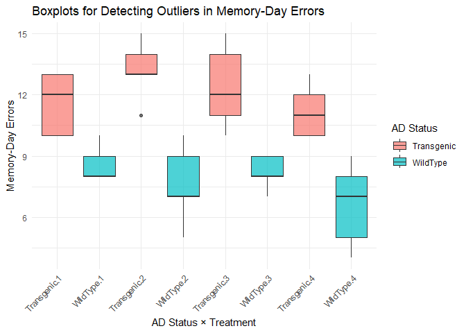

Two-Factor ANOVA on Alzheimer’s Mice Maze Errors
================
Espiritu, Joseph Raphael
2025-12-13

``` r
# Packages needed
packages <- c("tidyverse", "car", "rstatix")

# Check which packages are missing
missing_pkgs <- packages[!packages %in% rownames(installed.packages())]

# Install missing packages with CRAN mirror fallback
if (length(missing_pkgs) > 0) {
  tryCatch(
    {
      install.packages(missing_pkgs)
    },
    error = function(e) {
      install.packages(
        missing_pkgs,
        repos = "https://cloud.r-project.org/"
      )
    }
  )
}

# Load packages
library(tidyverse)
library(car)
library(rstatix)
```

## Introduction

This study examined whether **drug treatment** and **Alzheimer’s disease
(AD) status** affect maze performance in mice. Maze performance was
measured by the **number of errors committed on Memory Day**. A
**two-factor between-subjects ANOVA** was conducted to examine the main
effects of Drug and AD Status, as well as their interaction.

``` r
data <- data.frame(
AD_Status = factor(rep(c("Transgenic", "WildType"), each = 20)),
Treatment = factor(rep(rep(1:4, each = 5), 2)),
Training = c(
12,15,13,12,14,
15,17,16,17,14,
13,14,18,15,16,
14,13,12,14,15,
17,16,17,14,13,
14,18,16,17,14,
13,14,18,15,16,
14,13,12,14,15
),
Memory = c(
10,12,13,10,13,
13,13,14,15,11,
12,11,15,10,14,
12,11,10,13,10,
9,8,10,8,8,
7,10,5,9,7,
8,7,9,8,9,
7,9,5,8,4
)
)

str(data)
```

    ## 'data.frame':    40 obs. of  4 variables:
    ##  $ AD_Status: Factor w/ 2 levels "Transgenic","WildType": 1 1 1 1 1 1 1 1 1 1 ...
    ##  $ Treatment: Factor w/ 4 levels "1","2","3","4": 1 1 1 1 1 2 2 2 2 2 ...
    ##  $ Training : num  12 15 13 12 14 15 17 16 17 14 ...
    ##  $ Memory   : num  10 12 13 10 13 13 13 14 15 11 ...

``` r
data %>%
group_by(AD_Status, Treatment) %>%
summarise(
N = n(),
Mean = mean(Memory),
SD = sd(Memory),
SE = SD / sqrt(N)
)
```

    ## `summarise()` has grouped output by 'AD_Status'. You can override using the
    ## `.groups` argument.

    ## # A tibble: 8 × 6
    ## # Groups:   AD_Status [2]
    ##   AD_Status  Treatment     N  Mean    SD    SE
    ##   <fct>      <fct>     <int> <dbl> <dbl> <dbl>
    ## 1 Transgenic 1             5  11.6 1.52  0.678
    ## 2 Transgenic 2             5  13.2 1.48  0.663
    ## 3 Transgenic 3             5  12.4 2.07  0.927
    ## 4 Transgenic 4             5  11.2 1.30  0.583
    ## 5 WildType   1             5   8.6 0.894 0.4  
    ## 6 WildType   2             5   7.6 1.95  0.872
    ## 7 WildType   3             5   8.2 0.837 0.374
    ## 8 WildType   4             5   6.6 2.07  0.927

## **Descriptive Summary**

Across treatments, transgenic mice consistently showed **higher mean
memory error scores** than wild-type mice, indicating poorer memory
performance. In contrast, differences between treatments within each AD
status group were relatively small.

``` r
ggplot(data, aes(
  x = interaction(AD_Status, Treatment),
  y = Memory,
  fill = AD_Status
)) +
  geom_boxplot(alpha = 0.7) +
  labs(
    x = "AD Status × Treatment",
    y = "Memory-Day Errors",
    title = "Boxplots for Detecting Outliers in Memory-Day Errors",
    fill = "AD Status"
  ) +
  theme_minimal() +
  theme(axis.text.x = element_text(angle = 45, hjust = 1))
```

<!-- -->

``` r
str(data$Memory)
```

    ##  num [1:40] 10 12 13 10 13 13 13 14 15 11 ...

``` r
data %>%
group_by(AD_Status, Treatment) %>%
summarise(
shapiro_p = shapiro.test(Memory)$p.value
)
```

    ## `summarise()` has grouped output by 'AD_Status'. You can override using the
    ## `.groups` argument.

    ## # A tibble: 8 × 3
    ## # Groups:   AD_Status [2]
    ##   AD_Status  Treatment shapiro_p
    ##   <fct>      <fct>         <dbl>
    ## 1 Transgenic 1            0.0857
    ## 2 Transgenic 2            0.777 
    ## 3 Transgenic 3            0.754 
    ## 4 Transgenic 4            0.421 
    ## 5 WildType   1            0.0460
    ## 6 WildType   2            0.758 
    ## 7 WildType   3            0.314 
    ## 8 WildType   4            0.754

``` r
leveneTest(Memory ~ AD_Status * Treatment, data = data)
```

    ## Levene's Test for Homogeneity of Variance (center = median)
    ##       Df F value Pr(>F)
    ## group  7  0.8275 0.5722
    ##       32

## **Assumption Checks**

The assumption of **normality** was assessed using the Shapiro–Wilk test
for each combination of AD status and treatment. All groups showed
approximately normal distributions (*p* \> .05), except for one Wild
Type–Treatment 1 group (*p* = .046). Given the robustness of ANOVA to
minor violations of normality and the balanced group sizes, the analysis
was deemed appropriate.

The assumption of **homogeneity of variances** was tested using Levene’s
test and was met, *F*(7, 32) = 0.83, *p* = .572, indicating equal
variances across groups.

Visual inspection of **boxplots** indicated no **extreme outliers** in
memory-day maze errors across groups.

``` r
anova_model <- aov(Memory ~ AD_Status * Treatment, data = data)
summary(anova_model)
```

    ##                     Df Sum Sq Mean Sq F value   Pr(>F)    
    ## AD_Status            1 189.22  189.22  75.313 6.45e-10 ***
    ## Treatment            3  14.48    4.83   1.920    0.146    
    ## AD_Status:Treatment  3   8.67    2.89   1.151    0.344    
    ## Residuals           32  80.40    2.51                     
    ## ---
    ## Signif. codes:  0 '***' 0.001 '**' 0.01 '*' 0.05 '.' 0.1 ' ' 1

``` r
anova_test(
data = data,
dv = Memory,
between = c(AD_Status, Treatment)
)
```

    ## ANOVA Table (type II tests)
    ## 
    ##                Effect DFn DFd      F        p p<.05   ges
    ## 1           AD_Status   1  32 75.313 6.45e-10     * 0.702
    ## 2           Treatment   3  32  1.920 1.46e-01       0.153
    ## 3 AD_Status:Treatment   3  32  1.151 3.44e-01       0.097

## **ANOVA Results**

The ANOVA revealed a **significant main effect of AD status**, *F*(1,
32) = 75.31, *p* \< .001, with a **large effect size**, generalized η² =
.702. Transgenic mice committed significantly more memory-day maze
errors than Wild Type mice.

There was **no significant main effect of treatment**, *F*(3, 32) =
1.92, *p* = .146, generalized η² = .153, indicating that the number of
memory errors did not differ significantly across the four drug
treatments.

The **interaction between AD status and treatment** was also not
significant, *F*(3, 32) = 1.15, *p* = .344, generalized η² = .097,
suggesting that the effect of treatment on memory errors did not depend
on AD status.

``` r
data %>%
pairwise_t_test(
Memory ~ Treatment,
p.adjust.method = "holm"
)
```

    ## # A tibble: 6 × 9
    ##   .y.    group1 group2    n1    n2     p p.signif p.adj p.adj.signif
    ## * <chr>  <chr>  <chr>  <int> <int> <dbl> <chr>    <dbl> <chr>       
    ## 1 Memory 1      2         10    10 0.811 ns           1 ns          
    ## 2 Memory 1      3         10    10 0.873 ns           1 ns          
    ## 3 Memory 2      3         10    10 0.936 ns           1 ns          
    ## 4 Memory 1      4         10    10 0.341 ns           1 ns          
    ## 5 Memory 2      4         10    10 0.236 ns           1 ns          
    ## 6 Memory 3      4         10    10 0.268 ns           1 ns

## **Post Hoc Comparisons**

Because the main effect of treatment was not significant,
**Holm-adjusted pairwise comparisons** were conducted for completeness.
These comparisons indicated that **no significant differences** were
observed between any pair of treatments (all adjusted *p* values =
1.00).

# **Summary**

A two-way between-subjects analysis of variance (ANOVA) was conducted to
examine the effects of **Alzheimer’s disease (AD) status** (Transgenic
vs. Wild Type) and **drug treatment** (Treatments 1–4) on **memory-day
maze errors** in mice. The results indicate that **Alzheimer’s disease
status has a strong and significant effect on memory performance**,
whereas **drug treatment did not significantly reduce memory errors**,
nor did it interact with AD status. These findings suggest that, within
the scope of this experiment, the tested drug treatments were not
effective in improving memory performance, particularly in transgenic
mice modeling Alzheimer’s disease.

[GitHub
Repository](https://github.com/Josephw00t12/RMD-and-Rstudio/tree/main/APM1111%20Stat%20Theory%20-%20Espiritu)
