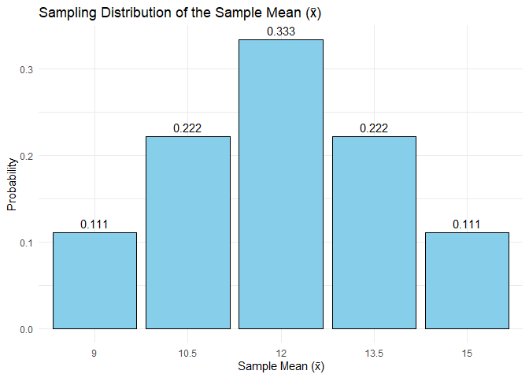
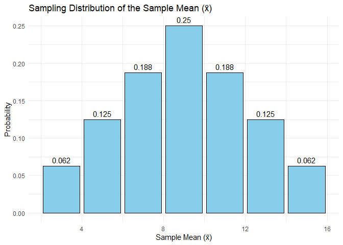

FA5
================
Joseph Raphael M. Espiritu, Harneyyer Clores

``` r
knitr::opts_chunk$set(echo = TRUE)
```

# Problem 8.17 – Mean and Variance of X

Midwestern University has 1/3 of its students taking **9 credit hours**,
1/3 taking **12 credit hours**, and 1/3 taking **15 credit hours**.  
We define $X$ as the number of credit hours.  
Thus, the probability distribution is:

| X   | p(X) |
|-----|------|
| 9   | 1/3  |
| 12  | 1/3  |
| 15  | 1/3  |

The mean and variance are calculated as follows:

$$ \mu_X = \sum X p(X) = 9(1/3) + 12(1/3) + 15(1/3) = 12 $$

$$ \sigma_X^2 = \sum X^2 p(X) - \mu_X^2 = (81 + 144 + 225)(1/3) - 144 = 150 - 144 = 6 $$

Hence, the distribution is **uniform**.

``` r
X <- c(9, 12, 15)
pX <- c(1/3, 1/3, 1/3)

mu_X <- sum(X * pX)
var_X <- sum(X^2 * pX) - mu_X^2

mu_X
```

    ## [1] 12

``` r
var_X
```

    ## [1] 6

------------------------------------------------------------------------

# Problem 8.18 – Sampling Distribution of the Mean

We now take **all samples of size n = 2 (with replacement)** from this
population.

Each pair (e.g., (9,9), (9,12), (9,15), etc.) is a **sample**.  
For each sample, we compute its **sample mean (x̄)**.

| Sample  | Mean (x̄) | Probability p(x̄) | x̄ × p(x̄) | x̄² × p(x̄) |
|---------|----------|------------------|----------|-----------|
| (9,9)   | 9        | 1/9              | 1.0000   | 9         |
| (9,12)  | 10.5     | 2/9              | 2.3333   | 24.5      |
| (9,15)  | 12       | 1/9              | 1.3333   | 16        |
| (12,9)  | 10.5     | 2/9              | 2.3333   | 24.5      |
| (12,12) | 12       | 1/9              | 1.3333   | 16        |
| (12,15) | 13.5     | 2/9              | 3.0000   | 40.5      |
| (15,9)  | 12       | 1/9              | 1.3333   | 16        |
| (15,12) | 13.5     | 2/9              | 3.0000   | 40.5      |
| (15,15) | 15       | 1/9              | 1.6667   | 25        |

The total probability = 1.  
Now we can find:

$$ \mu_{\bar{X}} = \sum (\bar{X} \cdot p(\bar{X})) = 12 $$

$$ \sigma_{\bar{X}}^2 = \sum (\bar{X}^2 \cdot p(\bar{X})) - \mu_{\bar{X}}^2 = 12 - 12^2 = 3 $$

Hence, $\sigma_{\bar{X}}^2 = \frac{\sigma_X^2}{2} = \frac{6}{2} = 3$.

``` r
samples <- expand.grid(X, X)
xbar <- rowMeans(samples)

# Probability for each unique mean value
xbar_values <- unique(xbar)
p_xbar <- table(xbar) / length(xbar)

# Expected mean and variance of sampling distribution
mu_xbar <- sum(as.numeric(names(p_xbar)) * p_xbar)
var_xbar <- sum((as.numeric(names(p_xbar))^2) * p_xbar) - mu_xbar^2

mu_xbar
```

    ## [1] 12

``` r
var_xbar
```

    ## [1] 3

``` r
library(ggplot2)

# Create data frame for plotting
df <- data.frame(
  xbar = as.numeric(names(p_xbar)),
  probability = as.numeric(p_xbar)
)

# Plot distribution
ggplot(df, aes(x = factor(xbar), y = probability)) +
  geom_bar(stat = "identity", fill = "skyblue", color = "black") +
  geom_text(aes(label = round(probability, 3)), vjust = -0.5) +
  labs(
    title = "Sampling Distribution of the Sample Mean (x̄)",
    x = "Sample Mean (x̄)",
    y = "Probability"
  ) +
  theme_minimal()
```

<!-- -->

------------------------------------------------------------------------

# Step-by-Step Explanation of Each Column

1.  **Sample (A, B)** – All possible combinations of X values when
    sampling with replacement (9, 12, 15). There are 9 total
    combinations (3×3).  
2.  **x̄ (Mean)** – The mean of each sample. Example: (9,15) ⇒ (9+15)/2 =
    12.  
3.  **p(x̄)** – The probability of each unique mean occurring. Since all
    combinations are equally likely (1/9 each), p(x̄) = (number of
    occurrences of x̄)/9.  
4.  **x̄ × p(x̄)** – Used to compute the expected mean of the sampling
    distribution.  
5.  **x̄² × p(x̄)** – Used to compute the variance of the sampling
    distribution.

------------------------------------------------------------------------

# Verification

``` r
c(mu_X = mu_X, mu_xbar = mu_xbar, var_X = var_X, var_xbar = var_xbar)
```

    ##     mu_X  mu_xbar    var_X var_xbar 
    ##       12       12        6        3

We find that:  
$\mu_X = \mu_{\bar{X}} = 12$  
$\sigma_{\bar{X}}^2 = \frac{\sigma_X^2}{2} = 3$

Thus, the theory holds true.

# Problem 8.21:

``` r
population <- c(3, 7, 11, 15)

pop_mean <- mean(population)
pop_sd <- sd(population)  # sample SD by default; use population SD instead
pop_sd <- sqrt(mean((population - pop_mean)^2))  # population SD formula
pop_mean; pop_sd
```

    ## [1] 9

    ## [1] 4.472136

``` r
samples <- expand.grid(population, population)
sample_means <- rowMeans(samples)
table_means <- as.data.frame(table(sample_means))
table_means$Probability <- table_means$Freq / nrow(samples)
table_means
```

    ##   sample_means Freq Probability
    ## 1            3    1      0.0625
    ## 2            5    2      0.1250
    ## 3            7    3      0.1875
    ## 4            9    4      0.2500
    ## 5           11    3      0.1875
    ## 6           13    2      0.1250
    ## 7           15    1      0.0625

``` r
mean_sampling <- sum(as.numeric(as.character(table_means$sample_means)) * table_means$Probability)
sd_sampling <- sqrt(sum((as.numeric(as.character(table_means$sample_means)) - mean_sampling)^2 * table_means$Probability))
mean_sampling; sd_sampling
```

    ## [1] 9

    ## [1] 3.162278

``` r
theoretical_mean <- pop_mean
theoretical_sd <- pop_sd / sqrt(2)

theoretical_mean; theoretical_sd
```

    ## [1] 9

    ## [1] 3.162278

``` r
library(ggplot2)

ggplot(table_means, aes(x = as.numeric(as.character(sample_means)), 
                        y = Probability)) +
  geom_col(fill = "skyblue", color = "black") +
  geom_text(aes(label = round(Probability, 3)), vjust = -0.5) +
  labs(title = "Sampling Distribution of the Sample Mean (x̄)",
       x = "Sample Mean (x̄)",
       y = "Probability") +
  theme_minimal()
```

<!-- -->

``` r
data.frame(
  Description = c("Population Mean (μ)", 
                  "Population SD (σ)", 
                  "Mean of Sampling Dist. (μx̄)", 
                  "SD of Sampling Dist. (σx̄)"),
  Value = c(pop_mean, pop_sd, mean_sampling, sd_sampling)
)
```

    ##                   Description    Value
    ## 1         Population Mean (μ) 9.000000
    ## 2           Population SD (σ) 4.472136
    ## 3 Mean of Sampling Dist. (μx̄) 9.000000
    ## 4   SD of Sampling Dist. (σx̄) 3.162278

# Problem 8.34:

``` r
#(a) Probability that less than 40% will be boys
# exact binomial
p_less_80_exact <- pbinom(79, size = 200, prob = 0.5)
p_less_80_exact
```

    ## [1] 0.001817474

``` r
#(b) Probability that between 43% and 57% will be girls
# exact binomial: P(86 <= X <= 114)
p_between_exact <- pbinom(114, size = 200, prob = 0.5) - pbinom(85, size = 200, prob = 0.5)
p_between_exact
```

    ## [1] 0.9599628

``` r
#(c) Probability that more than 54% will be boys
# exact binomial: P(X >= 109)
p_more_108_exact <- 1 - pbinom(108, size = 200, prob = 0.5)
p_more_108_exact
```

    ## [1] 0.1146233

# Problem 8.49:

``` r
x <- c(6, 9, 12, 15, 18)
p <- c(0.1, 0.2, 0.4, 0.2, 0.1)
mu <- sum(x * p)
sigma2 <- sum((x - mu)^2 * p)

mu
```

    ## [1] 12

``` r
sigma2
```

    ## [1] 10.8

``` r
samples <- expand.grid(x1 = x, x2 = x) # all 25 combinations
samples$mean <- (samples$x1 + samples$x2) / 2
samples$prob <- p[match(samples$x1, x)] * p[match(samples$x2, x)]

head(samples, 10)
```

    ##    x1 x2 mean prob
    ## 1   6  6  6.0 0.01
    ## 2   9  6  7.5 0.02
    ## 3  12  6  9.0 0.04
    ## 4  15  6 10.5 0.02
    ## 5  18  6 12.0 0.01
    ## 6   6  9  7.5 0.02
    ## 7   9  9  9.0 0.04
    ## 8  12  9 10.5 0.08
    ## 9  15  9 12.0 0.04
    ## 10 18  9 13.5 0.02

``` r
sum(samples$prob)
```

    ## [1] 1

``` r
knitr::kable(samples, caption = "All 25 samples (with replacement), their means, and probabilities")
```

|  x1 |  x2 | mean | prob |
|----:|----:|-----:|-----:|
|   6 |   6 |  6.0 | 0.01 |
|   9 |   6 |  7.5 | 0.02 |
|  12 |   6 |  9.0 | 0.04 |
|  15 |   6 | 10.5 | 0.02 |
|  18 |   6 | 12.0 | 0.01 |
|   6 |   9 |  7.5 | 0.02 |
|   9 |   9 |  9.0 | 0.04 |
|  12 |   9 | 10.5 | 0.08 |
|  15 |   9 | 12.0 | 0.04 |
|  18 |   9 | 13.5 | 0.02 |
|   6 |  12 |  9.0 | 0.04 |
|   9 |  12 | 10.5 | 0.08 |
|  12 |  12 | 12.0 | 0.16 |
|  15 |  12 | 13.5 | 0.08 |
|  18 |  12 | 15.0 | 0.04 |
|   6 |  15 | 10.5 | 0.02 |
|   9 |  15 | 12.0 | 0.04 |
|  12 |  15 | 13.5 | 0.08 |
|  15 |  15 | 15.0 | 0.04 |
|  18 |  15 | 16.5 | 0.02 |
|   6 |  18 | 12.0 | 0.01 |
|   9 |  18 | 13.5 | 0.02 |
|  12 |  18 | 15.0 | 0.04 |
|  15 |  18 | 16.5 | 0.02 |
|  18 |  18 | 18.0 | 0.01 |

All 25 samples (with replacement), their means, and probabilities

``` r
sampling_dist <- aggregate(prob ~ mean, data = samples, sum)
knitr::kable(sampling_dist, caption = "Sampling Distribution of the Sample Mean")
```

| mean | prob |
|-----:|-----:|
|  6.0 | 0.01 |
|  7.5 | 0.04 |
|  9.0 | 0.12 |
| 10.5 | 0.20 |
| 12.0 | 0.26 |
| 13.5 | 0.20 |
| 15.0 | 0.12 |
| 16.5 | 0.04 |
| 18.0 | 0.01 |

Sampling Distribution of the Sample Mean

``` r
mu_xbar <- sum(sampling_dist$mean * sampling_dist$prob)
var_xbar <- sum((sampling_dist$mean - mu_xbar)^2 * sampling_dist$prob)

mu_xbar
```

    ## [1] 12

``` r
var_xbar
```

    ## [1] 5.4

``` r
sigma2 / 2
```

    ## [1] 5.4
