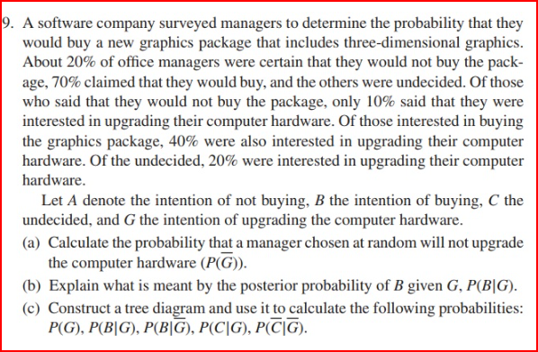
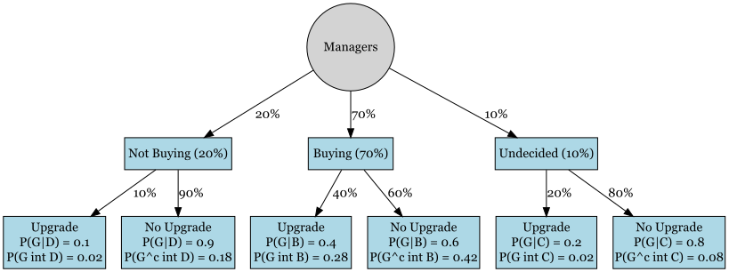

FA-5 R 7.1
================
Espiritu, Joseph Raphael M.
2025-03-05

### **Exercises 7.1**

## Problem Statement 1:


``` r
p_server <- c(0.40, 0.25, 0.35)  # Probability of each server
p_error  <- c(0.01, 0.02, 0.015) # Error probability for each server

# Compute total probability of error
p_email_error <- sum(p_server * p_error)

p_email_error
```

    ## [1] 0.01425

``` r
p_email_no_error <- 1 - p_email_error
p_email_no_error
```

    ## [1] 0.98575

``` r
p_no_error_given_s1 <- 1 - p_error[1]  # P(E^c | S1)

# Compute P(S1 | E^c)
p_s1_given_no_error <- (p_no_error_given_s1 * p_server[1]) / p_email_no_error

p_s1_given_no_error
```

    ## [1] 0.4017246

## Problem Statement 2:



``` r
library(DiagrammeR)
```

    ## Warning: package 'DiagrammeR' was built under R version 4.4.3

``` r
library(DiagrammeRsvg)
```

    ## Warning: package 'DiagrammeRsvg' was built under R version 4.4.3

``` r
library(rsvg)
```

    ## Warning: package 'rsvg' was built under R version 4.4.3

    ## Linking to librsvg 2.57.0

``` r
library(knitr)
library(webshot2)
```

    ## Warning: package 'webshot2' was built under R version 4.4.3

``` r
p_A <- 0.20  # Not buying
p_B <- 0.70  # Buying
p_C <- 0.10  # Undecided

p_G_given_A <- 0.10  # P(G | A)
p_G_given_B <- 0.40  # P(G | B)
p_G_given_C <- 0.20  # P(G | C)

# Compute P(G)
p_G <- (p_G_given_A * p_A) + (p_G_given_B * p_B) + (p_G_given_C * p_C)

p_G
```

    ## [1] 0.32

``` r
p_B_given_G <- (p_G_given_B * p_B) / p_G
p_B_given_G
```

    ## [1] 0.875

``` r
diagram <- grViz("
digraph Tree {
  node [shape=box, style=filled, fillcolor=lightblue] 

  Start [label='Managers', shape=circle, fillcolor=lightgray]
  NotBuying [label='Not Buying (20%)']
  Buying [label='Buying (70%)']
  Undecided [label='Undecided (10%)']
  Upgrade_NotBuying [label='Upgrade \\nP(G|D) = 0.1\\nP(G int D) = 0.02']
  NoUpgrade_NotBuying [label='No Upgrade \\nP(G|D) = 0.9\\nP(G^c int D) = 0.18']
  Upgrade_Buying [label='Upgrade \\nP(G|B) = 0.4\\nP(G int B) = 0.28']
  NoUpgrade_Buying [label='No Upgrade \\nP(G|B) = 0.6\\nP(G^c int B) = 0.42']
  Upgrade_Undecided [label='Upgrade \\nP(G|C) = 0.2\\nP(G int C) = 0.02']
  NoUpgrade_Undecided [label='No Upgrade \\nP(G|C) = 0.8\\nP(G^c int C) = 0.08']

  Start -> NotBuying [label=' 20%']
  Start -> Buying [label=' 70%']
  Start -> Undecided [label=' 10%']

  NotBuying -> Upgrade_NotBuying [label=' 10%']
  NotBuying -> NoUpgrade_NotBuying [label=' 90%']

  Buying -> Upgrade_Buying [label=' 40%']
  Buying -> NoUpgrade_Buying [label=' 60%']

  Undecided -> Upgrade_Undecided [label=' 20%']
  Undecided -> NoUpgrade_Undecided [label=' 80%']
}
")

# Check if output format is HTML
if (knitr::is_html_output()) {
  diagram  # Render in HTML
} else {
  # Convert to image for non-HTML formats
  svg_file <- "tree_diagram.svg"
  png_file <- "tree_diagram.png"
  
  cat(export_svg(diagram), file = svg_file)
  rsvg_png(svg_file, png_file)
  
  
}
```

    ## file:///C:\Users\josep\AppData\Local\Temp\RtmpOE4AAO\file67dc4e8f5d3b\widget67dc666d6e2b.html screenshot completed

<!-- -->

## Problem Statement 3:

A **malicious spyware** can infect a computer system through either the
**Internet** or through **email**. The probabilities for the **entry
points** and the **detection rates** are as follows:

- **70%** of spyware infections occur through the **Internet**.
- **30%** of spyware infections occur through **Email**.

If the spyware enters via the **Internet**, the anti-virus detector will
detect it with a probability of **60%**. If it enters via **Email**, the
anti-virus will detect it with a probability of **80%**.

These probabilities can be expressed as:

- **70%** of all spyware comes through the **Internet**:
  $P(\text{Internet}) = 0.70$
- **30%** of all spyware comes through **Email**:
  $P(\text{Email}) = 0.30$
- The probability of detection if the spyware is from the **Internet**:
  $P(\text{Detected} | \text{Internet}) = 0.60$
- The probability of detection if the spyware is from **Email**:
  $P(\text{Detected} | \text{Email}) = 0.80$
- The probability of undetected spyware from the **Internet**:
  $P(\text{Undetected} | \text{Internet}) = 0.40$
- The probability of undetected spyware from **Email**:
  $P(\text{Undetected} | \text{Email}) = 0.20$

### Questions:

1)  What is the probability that this **spyware infects the system**?

2)  If the spyware is **detected**, what is the **probability that it
    came through the Internet**?

### Solution

- The probability of detected spyware is:

$$
P(\text{Detected}) = P(\text{Detected} | \text{Internet}) P(\text{Internet}) + P(\text{Detected} | \text{Email}) P(\text{Email})
$$

``` r
# Given Probabilities
P_Internet <- 0.70
P_Email <- 0.30
P_Detected_Internet <- 0.60
P_Detected_Email <- 0.80
P_Undetected_Internet <- 0.40
P_Undetected_Email <- 0.20

# Solving for Detected Spyware
P_Detected <- P_Detected_Internet * P_Internet + P_Detected_Email * P_Email

# Show Value
P_Detected
```

    ## [1] 0.66

Using **law of total probability**, the probability of receiving
**Undetected spyware** is:

$$
P(\text{Undetected}) = P(\text{Undetected} | \text{Internet}) P(\text{Internet}) + P(\text{Undetected} | \text{Email}) P(\text{Email})
$$

Using **Bayes’ theorem**, the probability that a **spyware detected from
the internet** is:

$$
P(\text{Internet} | \text{Detected}) = \frac{P(\text{Detected} | \text{Internet}) P(\text{Internet})}{P(\text{Detected})}
$$

------------------------------------------------------------------------

``` r
# Solving for Spyware Undetected
P_Undetected <- P_Undetected_Internet * P_Internet + P_Undetected_Email * P_Email

# Solving for Spyware detected from Internet
P_Internet_Detected <- P_Detected_Internet * P_Internet / P_Detected

# Show Values
P_Undetected
```

    ## [1] 0.34

``` r
P_Internet_Detected
```

    ## [1] 0.6363636

### Thus, **Undetected Spyware appears** 34% and **Detected spyware from the Internet appears** around 63.64% in any computer system.
