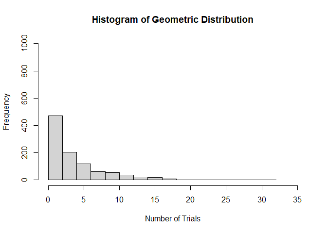

### **FA6 Questions**

#### ***1.*** Geometric Distribution. Provide an R code for the geometric distribution. The geometric distribution is a probability distribution that models the number of trials required to achieve the first success in a sequence of Bernoulli trials, where each trial has a constant probability of success.

1. Set the probability of success:  p <- 0.2

2. Generate 1000 random variables from the geometric distribution.


``` r
# Set probability of success
p <- 0.2

# Generate 1000 random variables from the geometric distribution using Rgeom
# Numbers of Fails before the first Success
x <- rgeom(1000, p)

meanx <- mean(x)
medianx <- median(x)
modx <- Mode(x)
sdx <- sd(x)
varx <- var(x)
kurtx <- round(kurtosis(x), 2)
skewx <- round(skewness(x), 2)

cat("Number of trials required to achieve first success:", modx, "\n")
```

```
## Number of trials required to achieve first success: 0
```

``` r
cat("Mean (2 decimal places):", round(meanx, 2), "\n")
```

```
## Mean (2 decimal places): 4.01
```

``` r
cat("Variance (2 decimal places):", round(varx, 2), "\n")
```

```
## Variance (2 decimal places): 19.21
```

``` r
cat("Standard deviation (2 decimal places):", round(sdx, 2), "\n")
```

```
## Standard deviation (2 decimal places): 4.38
```

``` r
cat("Kurtosis (2 decimal places):", kurtx, "\n")
```

```
## Kurtosis (2 decimal places): 7.41
```

``` r
cat("Skewness (2 decimal places):", skewx, "\n")
```

```
## Skewness (2 decimal places): 1.84
```
#### ***Histogram Plot***


``` r
hist(x, main = "Histogram of Geometric Distribution", xlab = "Number of Trials", ylab = "Frequency", ylim = c(0,1000), xlim = c(0,35), breaks = 20)
```

<!-- -->

#### ***2.*** Hypergeometric Distribution.  Consider a plant manufacturing IC chips of which 10% are expected to be defective. The chips are packed in boxes for export. Before transportation, a sample is drawn from each box. Estimate the probability that the sample contains more than 10% defectives, when:

 1. A sample of 10 is selected from a box of 40;
 2. A sample of 10 is selected from a box of 5000.


``` r
# Define parameters for the first scenario
N1 <- 40
K1 <- 0.1 * N1
n1 <- 10

# Calculate the probability of more than 10% defectives
prob_more_than_10_percent_1 <- sum(dhyper(1:10, K1, N1 - K1, n1))

# Define parameters for the second scenario
N2 <- 5000
K2 <- 0.1 * N2
n2 <- 10

# Calculate the probability of more than 10% defectives
prob_more_than_10_percent_2 <- sum(dhyper(1:10, K2, N2 - K2, n2))

cat("Probability of more than 10% defectives in scenario 1:", prob_more_than_10_percent_1, "\n")
```

```
## Probability of more than 10% defectives in scenario 1: 0.7001313
```

``` r
cat("Probability of more than 10% defectives in scenario 2:", prob_more_than_10_percent_2, "\n")
```

```
## Probability of more than 10% defectives in scenario 2: 0.6516705
```


