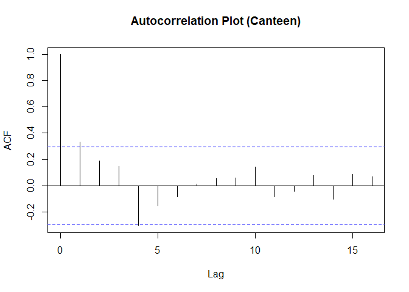
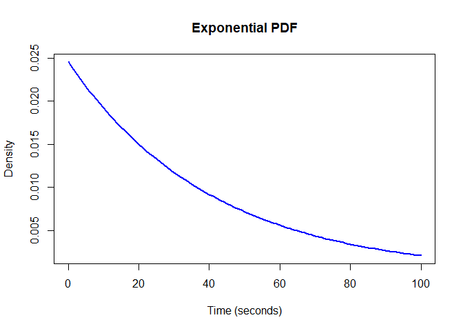
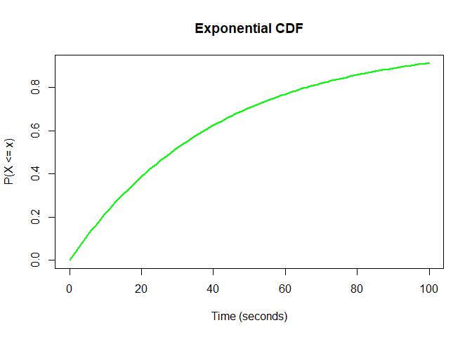
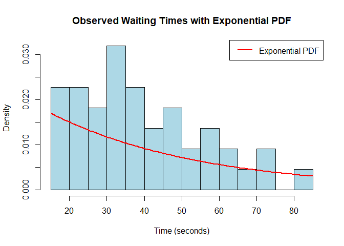
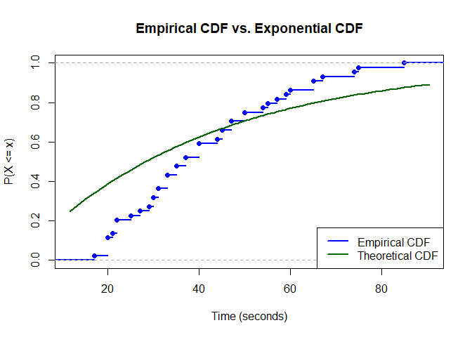

FA-7
================
Espiritu, Joseph Raphael M. Clores, Harneyyer Leosara
2025-04-10

#### 1. Practical Campus Problem

- Canteen Queue between during peak Hours (12pm-1pm)

#### 2. Data

- Canteen (Seconds) - { 45, 31, 21, 25, 33, 57, 74, 47, 50, 33, 44, 22,
  65, 75, 35, 85, 67, 30, 45, 27, 20, 33, 31, 54, 40, 65, 60, 35, 59,
  37, 50, 55, 20, 17, 22, 20, 20, 40, 37, 47, 40, 22, 29, 30 }

#### 3. Verification

``` r
# 1. DATA: Time between student arrivals at the canteen (in seconds)
canteen_data <- c(45, 31, 21, 25, 33, 57, 74, 47, 50, 33, 44,
                  22, 65, 75, 35, 85, 67, 30, 45, 27, 20, 33,
                  31, 54, 40, 65, 60, 35, 59, 37, 50, 55, 20,
                  17, 22, 20, 20, 40, 37, 47, 40, 22, 29, 30)
# 2. MEAN AND LAMBDA (rate)
mean_timeC <- mean(canteen_data)
lambdaC <- 1 / mean_timeC
acf(canteen_data, main = "Autocorrelation Plot (Canteen)")

cdf_exponential <- function(x, lambda) {
  1 - exp(-lambda * x)
}
pdf_exponential <- function(x, lambda) {
  lambda * exp(-lambda * x)
}

x_vals <- seq(0, 100, by = 1)
pdf_valsC <- pdf_exponential(x_vals, lambdaC)
cdf_valsC <- cdf_exponential(x_vals, lambdaC)

# PDF Plot
plot(x_vals, pdf_valsC, type = "l", col = "blue", lwd = 2,
     main = "Exponential PDF", xlab = "Time (seconds)", ylab = "Density")

# CDF Plot
plot(x_vals, cdf_valsC, type = "l", col = "green", lwd = 2,
     main = "Exponential CDF", xlab = "Time (seconds)", ylab = "P(X <= x)")


cat("If most points fall within the blue dashed lines, it means there's no significant correlation between 
    successive observations → supports independence and occur randomly over time \n")
cat("Lambda (Canteen) (rate per second):", lambdaC, "\n")
```

<!-- -->

    ## If most points fall within the blue dashed lines, it means there's no significant correlation between successive observations → supports independence and occur randomly over time

    ## Lambda (Canteen) (rate per second): 0.0245262

#### 4. Compute Key Parameters

<!-- --><!-- -->

    ## Mean waiting time (Canteen) (seconds): 40.77273

#### 5. Interpretation

Mean waiting time: 40.77 seconds

Rate (λ): 0.0245 events per second → This means, on average, 1 student
arrives every ~41 seconds

EPDF A high probability density near 0 seconds, which gradually
decreases over time. Indicates that shorter wait times between students
arriving at the canteen are more common, while longer waits are less
likely. Most students tend to arrive within the first few seconds after
the previous student.

ECDF The longer the time you wait, the higher the chance that a student
will have arrived by then.

    ## 21.75005 % at 10 seconds

    ## 38.76945 % at 20 seconds

    ## 52.08713 % at 30 seconds

    ## 62.5082 % at 40 seconds

    ## 70.66268 % at 50 seconds

    ## 77.04357 % at 60 seconds

#### 6. Report Findings

- The scenario selected is the time between students arriving at a
  canteen. This is a practical campus situation where events (student
  arrivals) are expected to occur randomly and independently over time.
- A total of 44 observations were recorded, representing the time in
  seconds between consecutive student arrivals at the canteen.
  Observations were manually collected during peak hours for variability
  in arrival patterns.
- Sample mean (waiting time): 40.77 seconds
- Estimated rate λ (lambda): 0.0245 arrivals per second

Expected Waiting Time The mean waiting time is ~41 seconds. This means,
on average, if you’re waiting at the canteen, you can expect another
student to show up within 40–41 seconds.

Implications Queue Management: If too many students arrive close
together, congestion may happen. But exponential spread implies bursts
of arrivals, not steady flow. Staff Scheduling: Since arrival is random
but has a predictable average, staffing can be optimized to accommodate
peak arrival times.

<!-- --><!-- -->
