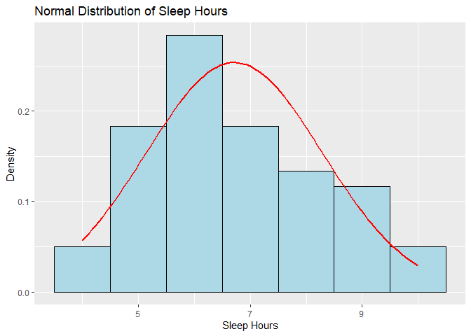
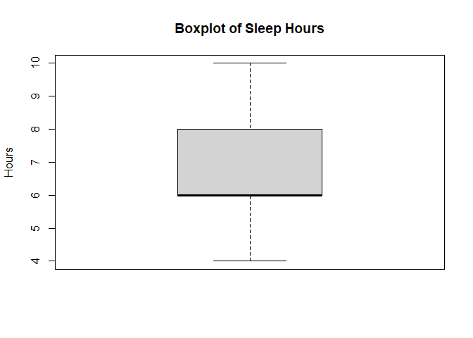

FA-9
================
Espiritu, Joseph Raphael M. Clores, Harneyyer Leosara
2025-05-07

#### **1. Campus Normal Distribution**

- Sleep Hours of College Students

#### **2. Data**

- Sleep Time (Hours) (60 Participants) - { 7, 7, 5, 6, 6, 6, 5, 6, 6, 6,
  6, 8, 6, 6, 9, 7, 7, 9, 7, 8, 8, 7, 7, 8, 5, 4, 9, 10, 9, 8, 6, 5, 4,
  10, 7, 5, 6, 7, 4, 5, 7, 6, 5, 6, 8, 9, 10, 5, 6, 6, 5, 8, 9, 9, 6, 5,
  6, 7, 5, 8 }

#### \***3. Organization/Analyzation**

``` r
# 1. DATA
sleep_data <- c(7, 7, 5, 6, 6, 6, 5, 6, 6, 6,
                6, 8, 6, 6, 9, 7, 7, 9, 7, 8,
                8, 7, 7, 8, 5, 4, 9, 10, 9, 8,
                6, 5, 4, 10, 7, 5, 6, 7, 4, 5,
                7, 6, 5, 6, 8, 9, 10, 5, 6, 6, 
                5, 8, 9, 9, 6, 5,  6, 7, 5, 8 )

summary(sleep_data)

# Create frequency table
freq_table <- as.data.frame(table(sleep_data))
colnames(freq_table) <- c("Sleep_Hours", "Frequency")
freq_table

# Calculate mean and standard deviation
mean_sleep <- mean(sleep_data)
sd_sleep <- sd(sleep_data)
cat("Mean: ", mean_sleep)
cat("Standard Deviation: ",sd_sleep)

# Plot normal distribution curve (updated ggplot2 syntax)
library(ggplot2)

ggplot(data.frame(sleep_data), aes(x = sleep_data)) +
  geom_histogram(aes(y = after_stat(density)), binwidth = 1, fill = "lightblue", color = "black") +
  stat_function(fun = dnorm, args = list(mean = mean_sleep, sd = sd_sleep), 
                color = "red", linewidth = 1) +
  labs(title = "Normal Distribution of Sleep Hours",
       x = "Sleep Hours", y = "Density")

# Calculate boundaries
one_sd <- mean_sleep + c(-1, 1) * sd_sleep
two_sd <- mean_sleep + c(-2, 2) * sd_sleep
three_sd <- mean_sleep + c(-3, 3) * sd_sleep

# Percentages within each range
within_1sd <- mean(sleep_data >= one_sd[1] & sleep_data <= one_sd[2]) * 100
within_2sd <- mean(sleep_data >= two_sd[1] & sleep_data <= two_sd[2]) * 100
within_3sd <- mean(sleep_data >= three_sd[1] & sleep_data <= three_sd[2]) * 100

data.frame(
  Range = c("Within 1 SD", "Within 2 SD", "Within 3 SD"),
  Percentage = c(within_1sd, within_2sd, within_3sd)
)

# Check symmetry and outliers
boxplot(sleep_data, main = "Boxplot of Sleep Hours", ylab = "Hours")
```

    ##    Min. 1st Qu.  Median    Mean 3rd Qu.    Max. 
    ##   4.000   6.000   6.000   6.717   8.000  10.000

    ##   Sleep_Hours Frequency
    ## 1           4         3
    ## 2           5        11
    ## 3           6        17
    ## 4           7        11
    ## 5           8         8
    ## 6           9         7
    ## 7          10         3

    ## Mean:  6.716667

    ## Standard Deviation:  1.574066

    ## Warning: package 'ggplot2' was built under R version 4.4.3

<!-- -->

    ##         Range Percentage
    ## 1 Within 1 SD         60
    ## 2 Within 2 SD         95
    ## 3 Within 3 SD        100

<!-- -->

#### ***4. Interpretation***

1.  **Is the distribution symmetric?**
    - The mean is around 6.72 hours and median = 6 hours, suggesting the
      center is around 6–7 hours.
    - The histogram and normal curve show a roughly bell-shaped
      distribution.
    - Overall, it’s **approximately symmetric**, but with minor leftward
      skew.
2.  **Are there outliers?**
    - Boxplot shows no extreme outliers beyond the whiskers.
    - All data points fall within 3 standard deviations.
    - While 4 hours appears low, it’s still within expected variation.
3.  **What does the shape of the distribution imply?**
    - The peak around 6–7 hours suggests **most students average
      slightly below recommended sleep** of 7-8 hours.
    - The shape shows few are extreme long sleepers 11+; variation is
      more on the shorter side since college campus setting.
    - **1-2 Hours** of less sleep will eventually take toll sometime but
      as long at we are getting 5-6 hours its seems fine based on
      standard deviation data
4.  **How can this data be useful?**
    - Identifies **typical sleep patterns** in FEU or regular college
      campus.
    - Helps health services **target interventions** and promote sleep
      management to those at 4-5 hours of sleep.
    - **Promoting time management** and learning how students sleep.
    - **Baseline data** for comparing across semesters or demographics.
5.  **Real-Life Implications or Recommendations**
    - Recommend awareness programs on **healthy sleep habits**.
    - Suggest academic policy reviews to **balance workload and reduce
      burnout**.
    - Propose student workshops on **stress management and time
      planning**.
    - The **importance of sleep** for mental health, academic
      performance, and physical wellness.
