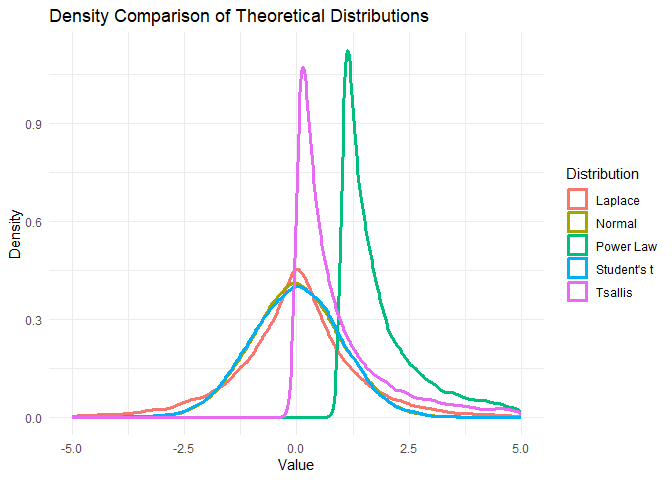
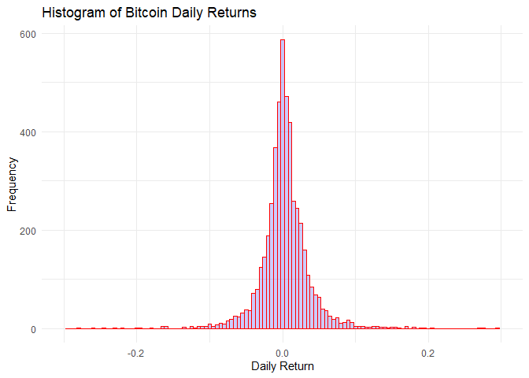
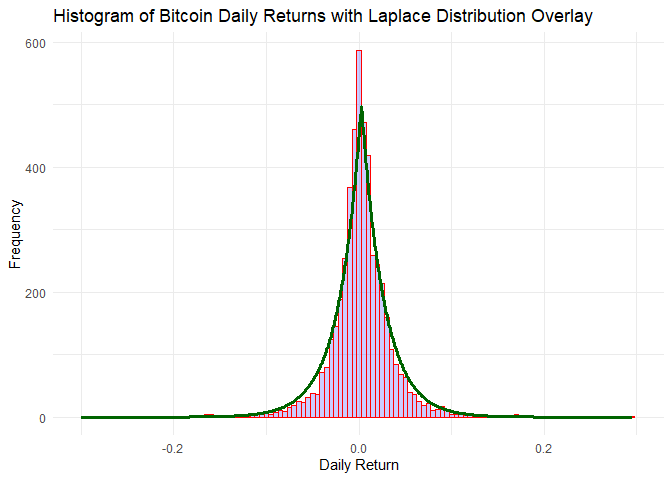

SA2-Part 1
================
Espiritu, Joseph Raphael; Clores, Harneyyer Leosara
2025-05-17

#### 1.Data Gathering and Info

- **Kaggle Data** (new link with same OHLC) (outdated previous link)
  (<https://www.kaggle.com/datasets/mczielinski/bitcoin-historical-data>)
  - Columns are **Timestamp**, **Open**, **High**, **Low**, **Close**,
    **Volume**
  - Timestamp (**Start time of time window (60s window), in Unix time**)
  - Open (**Open price at start time window**)
  - High (**High price at start time window**)
  - Low (**Low price at start time window**)
  - Close (**Close price at start time window**)
  - Volume (**Volume of BTC transacted in this window**)

#### 2. Processing Data and Graphing Distribution Tests

``` r
library(lubridate)   # Unix Data easier
library(tidyverse)   # Data analysis package
library(tsallisqexp) # Tsallis
library(poweRlaw)    # power Law
library(VGAM)        # Lapalce
library(patchwork)   # Combining Graphs

#1. Load and inspect the data
bitstamp_data <- read.csv("btcusd_1-min_data.csv")
summary(bitstamp_data)
```

    ##    Timestamp              Open               High               Low          
    ##  Min.   :1.325e+09   Min.   :     3.8   Min.   :     3.8   Min.   :     3.8  
    ##  1st Qu.:1.431e+09   1st Qu.:   425.5   1st Qu.:   425.7   1st Qu.:   425.3  
    ##  Median :1.536e+09   Median :  6630.8   Median :  6635.0   Median :  6627.0  
    ##  Mean   :1.536e+09   Mean   : 17660.3   Mean   : 17667.3   Mean   : 17653.1  
    ##  3rd Qu.:1.642e+09   3rd Qu.: 27550.0   3rd Qu.: 27555.0   3rd Qu.: 27544.0  
    ##  Max.   :1.747e+09   Max.   :109111.0   Max.   :109356.0   Max.   :108794.0  
    ##      Close              Volume        
    ##  Min.   :     3.8   Min.   :   0.000  
    ##  1st Qu.:   425.5   1st Qu.:   0.018  
    ##  Median :  6630.7   Median :   0.465  
    ##  Mean   : 17660.3   Mean   :   5.288  
    ##  3rd Qu.: 27550.0   3rd Qu.:   3.022  
    ##  Max.   :109036.0   Max.   :5853.852

``` r
#2. Clean and preprocess the data
bitstamp_data <- bitstamp_data %>%
  drop_na(Close) %>%                                  # Remove rows with missing Close values
  mutate(Date = as.Date(as.POSIXct(Timestamp, origin = "1970-01-01", tz = "UTC"))) %>%
  replace_na(list(Open = 0, High = 0, Low = 0, Close = 0, Volume = 0))  # Replace NAs in numeric columns with 0

# 3. Aggregate to daily level and calculate daily returns
daily_data <- bitstamp_data %>%
  group_by(Date) %>%
  summarise(
    Low = min(Low, na.rm = TRUE),
    High = max(High, na.rm = TRUE),
    .groups = "drop"
  ) %>%
  mutate(
    DailyMid = (Low + High) / 2,
    Return = (DailyMid / lag(DailyMid)) - 1
  ) %>%
  drop_na(Return)

# Store returns separately
returns <- daily_data$Return

# Sample size
sampleSize <- 20000
# Generate synthetic data from each distribution
set.seed(12345)  # for reproducibility

normal_sample    <- rnorm(sampleSize, mean = 0, sd = 1)
student_sample   <- rt(sampleSize, df = sampleSize - 2)
laplace_sample   <- rlaplace(sampleSize, location = 0, scale = 1)  # Laplace from VGAM
tsallis_sample   <- rtsal(sampleSize, shape = 1.5, scale = 1)      # Adjust shape/scale as needed
powerlaw_sample  <- rplcon(sampleSize, xmin = 1, alpha = 2.5)      # Must be > xmin

# Combine into one dataframe for ggplot
plot_data <- bind_rows(
  tibble(value = normal_sample, Distribution = "Normal"),
  tibble(value = student_sample, Distribution = "Student's t"),
  tibble(value = laplace_sample, Distribution = "Laplace"),
  tibble(value = tsallis_sample, Distribution = "Tsallis"),
  tibble(value = powerlaw_sample, Distribution = "Power Law")
)

# Plot all density curves on one plot
dist_plot <- ggplot(plot_data, aes(x = value, color = Distribution)) +
  geom_density(linewidth = 1.2) +
  labs(
    title = "Density Comparison of Theoretical Distributions",
    x = "Value",
    y = "Density"
  ) +
  theme_minimal() +
  xlim(-5, 5)

dist_plot
```

<!-- -->

``` r
# Plot 2: Bitcoin Returns Histogram
hist_plot <- ggplot(daily_data, aes(x = Return)) +
  geom_histogram(
    binwidth = 0.005,
    fill = "blue",
    color = "red",
    alpha = 0.2
  ) +
  labs(
    title = "Histogram of Bitcoin Daily Returns",
    x = "Daily Return",
    y = "Frequency"
  ) +
  xlim(-0.3, 0.3) +
  theme_minimal()

hist_plot
```

<!-- -->

#### 3. Kolmogorov–Smirnov (K–S) Test: Explanation and Its Application to Bitcoin Returns

- **Purpose of the K–S Test**
  - The Kolmogorov–Smirnov test is a **non-parametric test** that
    compares the **empirical distribution function (EDF)** of observed
    data with a **theoretical cumulative distribution function
    (CDF)**.  
  - It calculates the **maximum distance (D-statistic)** between these
    two distributions.  
  - A **smaller D value** suggests that the theoretical distribution is
    a good fit for the data.
- **Why Use the K–S Test on Bitcoin Returns?**
  - Bitcoin returns are known to exhibit **fat tails**, **volatility
    clustering**, and **extreme values**.  
  - The K–S test is ideal for identifying whether known theoretical
    distributions (e.g., Normal, Student’s t) can adequately model these
    returns.

#### Distributions Used in the K–S Test

1.  **Normal Distribution**
    - Symmetrical bell-shaped curve; defined by its **mean** and
      **standard deviation**.  
    - Assumes returns are independent and identically distributed
      (i.i.d.).  
    - **Limitation**: Does **not model extreme events well**.
2.  **Student’s t-Distribution**
    - Similar to the normal distribution, but with **heavier tails**,
      depending on the **degrees of freedom** n - 1.  
    - More suitable for data with **outliers** or **small sample
      sizes**.
3.  **Laplace Distribution**
    - Also called **double exponential distribution**; has a **sharper
      peak** and **heavier tails** than the normal.  
    - Well-suited for modeling **sudden jumps and frequent moderate
      shocks**.
4.  **Tsallis Distribution**
    - Arises from **non-extensive statistical mechanics**; introduces a
      **q-parameter** that governs the tail thickness.  
    - Designed for **systems with long-range dependencies**, like
      financial markets.
5.  **Power Law Distribution**
    - Heavy-tailed distribution following a decay.  
    - Captures **extreme rare events**—commonly used in finance and risk
      modeling.

#### 4. KS Test and D-Values from Bitcoin Data

``` r
# Sample size
n <- length(returns)

# --- Normal distribution ---
normal_sample <- rnorm(n, mean = mean(returns), sd = sd(returns))
ks_normal <- ks.test(returns, normal_sample)
```

    ## Warning in ks.test.default(returns, normal_sample): p-value will be approximate
    ## in the presence of ties

``` r
# --- Student's t distribution ---
# Degrees of freedom = n - 2
student_sample <- rt(n, df = n - 2)
# Scale and shift to match mean and sd of returns
student_sample <- student_sample * sd(returns) + mean(returns)
ks_student <- ks.test(returns, student_sample)
```

    ## Warning in ks.test.default(returns, student_sample): p-value will be
    ## approximate in the presence of ties

``` r
# --- Laplace distribution (VGAM) ---
# VGAM::rlaplace uses location (mean) and scale (b)
# Scale b = sd / sqrt(2)
laplace_scale <- sd(returns) / sqrt(2)
laplace_sample <- rlaplace(n, location = mean(returns), scale = laplace_scale)
ks_laplace <- ks.test(returns, laplace_sample)
```

    ## Warning in ks.test.default(returns, laplace_sample): p-value will be
    ## approximate in the presence of ties

``` r
# --- Tsallis distribution ---
# Generate random sample from Tsallis with parameters mean and sd from data
tsallis_sample <- rtsal(n, mean(returns), sd(returns))
ks_tsallis <- ks.test(returns, tsallis_sample)
```

    ## Warning in ks.test.default(returns, tsallis_sample): p-value will be
    ## approximate in the presence of ties

``` r
# --- Power Law distribution ---
# Generate random sample from Power Law with parameters (xmin = -0.3, alpha = sd)
powerlaw_sample <- rplcon(n, xmin = -0.3, alpha = sd(returns))
ks_powerlaw <- ks.test(returns, powerlaw_sample)
```

    ## Warning in ks.test.default(returns, powerlaw_sample): p-value will be
    ## approximate in the presence of ties

``` r
# Print KS test results
ks_normal
```

    ## 
    ##  Asymptotic two-sample Kolmogorov-Smirnov test
    ## 
    ## data:  returns and normal_sample
    ## D = 0.10031, p-value < 2.2e-16
    ## alternative hypothesis: two-sided

``` r
ks_student
```

    ## 
    ##  Asymptotic two-sample Kolmogorov-Smirnov test
    ## 
    ## data:  returns and student_sample
    ## D = 0.10051, p-value < 2.2e-16
    ## alternative hypothesis: two-sided

``` r
ks_laplace
```

    ## 
    ##  Asymptotic two-sample Kolmogorov-Smirnov test
    ## 
    ## data:  returns and laplace_sample
    ## D = 0.045445, p-value = 8.308e-05
    ## alternative hypothesis: two-sided

``` r
ks_tsallis
```

    ## 
    ##  Asymptotic two-sample Kolmogorov-Smirnov test
    ## 
    ## data:  returns and tsallis_sample
    ## D = 0.99447, p-value < 2.2e-16
    ## alternative hypothesis: two-sided

``` r
ks_powerlaw
```

    ## 
    ##  Asymptotic two-sample Kolmogorov-Smirnov test
    ## 
    ## data:  returns and powerlaw_sample
    ## D = 0.7955, p-value < 2.2e-16
    ## alternative hypothesis: two-sided

#### 5. Interpretation and Results

- **Normal Distribution**  
  The KS test shows a moderate statistic (D = 0.10031) but a highly
  significant p-value (\< 2.2e-16), strongly rejecting the hypothesis
  that Bitcoin returns follow a normal distribution. This aligns with
  financial data characteristics, which usually display heavy tails and
  volatility clustering not captured by normality.

- **Student’s t Distribution**  
  With a KS statistic similar to the normal (D = 0.10051) and a very low
  p-value (\< 2.2e-16), the Student’s t distribution with default
  parameters still fails to model Bitcoin returns well, despite its
  heavier tails.

- **Laplace Distribution**  
  The Laplace distribution shows the *smallest KS statistic* (D =
  0.045445) among all tested distributions and although the p-value
  (8.308e-05) rejects perfect fit, it provides the *closest
  approximation* to the empirical returns distribution.  
  This suggests that the Laplace’s heavier tails effectively capture the
  sharp jumps and large fluctuations typical in Bitcoin returns.

- **Tsallis Distribution**  
  The very large KS statistic (D = 0.99447) and highly significant
  p-value indicate that the Tsallis distribution does not fit the
  Bitcoin returns well with the current parameters.

- **Power Law Distribution**  
  Similarly, the high KS statistic (D = 0.7955) and low p-value
  demonstrate a poor fit. Power law may capture tail behavior but not
  the full distribution.

#### **Summary**

None of the tested **theoretical distributions perfectly fit Bitcoin
daily returns**, but the Laplace distribution provides the *best
practical approximation*, capturing heavy tails and jump behavior better
than others.

#### 6. Showcasing Overlay of Histogram and Laplace to see the **Practical Approximation**

``` r
# Fit Laplace parameters
mu <- mean(returns, na.rm = TRUE)
b <- sqrt(var(returns, na.rm = TRUE) / 2)  # scale parameter for Laplace

# Create x values for Laplace density
x_vals <- seq(min(returns, na.rm = TRUE), max(returns, na.rm = TRUE), length.out = 1000)
laplace_density <- dlaplace(x_vals, location = mu, scale = b)

# Binwidth for histogram
binwidth <- 0.005

# Extend breaks to cover all data
min_break <- floor(min(returns, na.rm = TRUE) / binwidth) * binwidth
max_break <- ceiling(max(returns, na.rm = TRUE) / binwidth) * binwidth

# Calculate counts for scaling
counts <- hist(returns, breaks = seq(min_break, max_break, by = binwidth), plot = FALSE)$counts
scale_factor <- length(returns) * binwidth

# Prepare Laplace line data frame explicitly
laplace_df <- data.frame(
  x = x_vals,
  y = laplace_density * scale_factor
)

ggplot(data = data.frame(returns), aes(x = returns)) +
  geom_histogram(binwidth = binwidth, fill = "blue", color = "red", alpha = 0.2) +
  geom_line(data = laplace_df, aes(x = x, y = y), color = "darkgreen", linewidth = 1.2) +  # specify data explicitly, use linewidth
  labs(
    title = "Histogram of Bitcoin Daily Returns with Laplace Distribution Overlay",
    x = "Daily Return",
    y = "Frequency"
  ) +
  xlim(-0.3, 0.3) +
  theme_minimal()
```

    ## Warning: Removed 1 row containing non-finite outside the scale range
    ## (`stat_bin()`).

    ## Warning: Removed 2 rows containing missing values or values outside the scale range
    ## (`geom_bar()`).

    ## Warning: Removed 83 rows containing missing values or values outside the scale range
    ## (`geom_line()`).

<!-- -->
